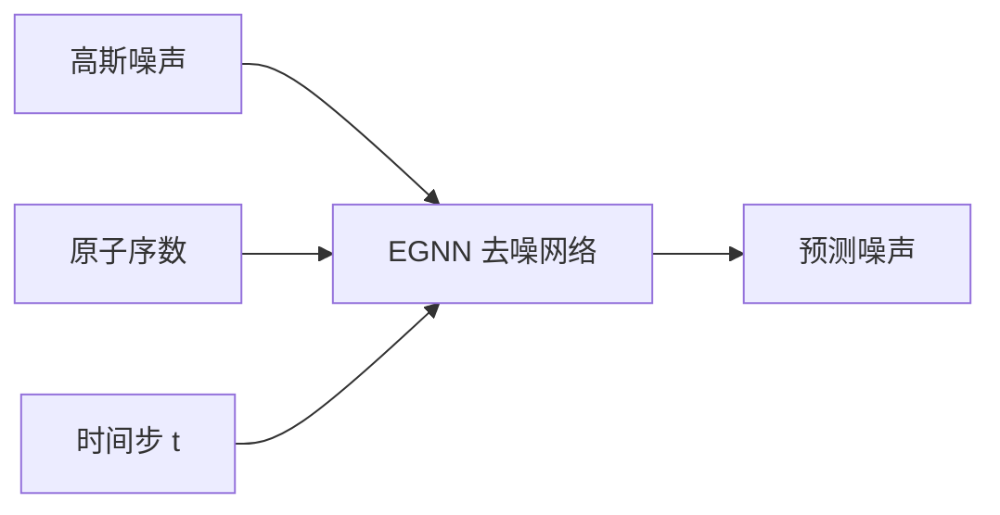
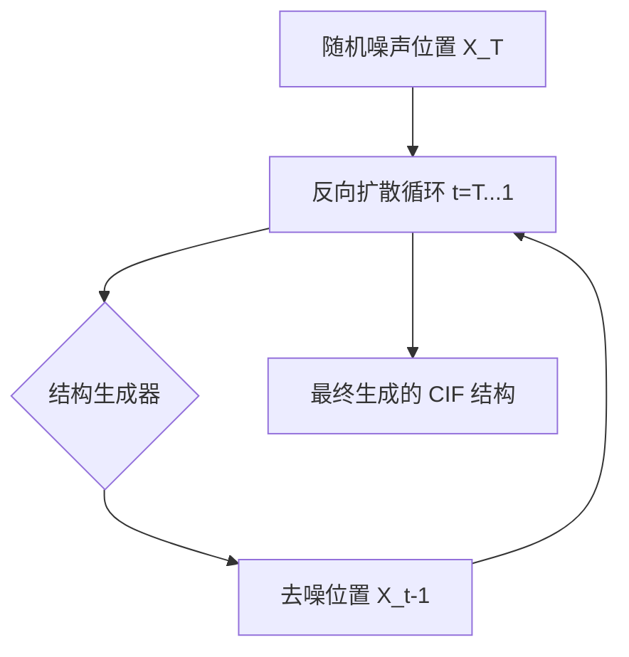
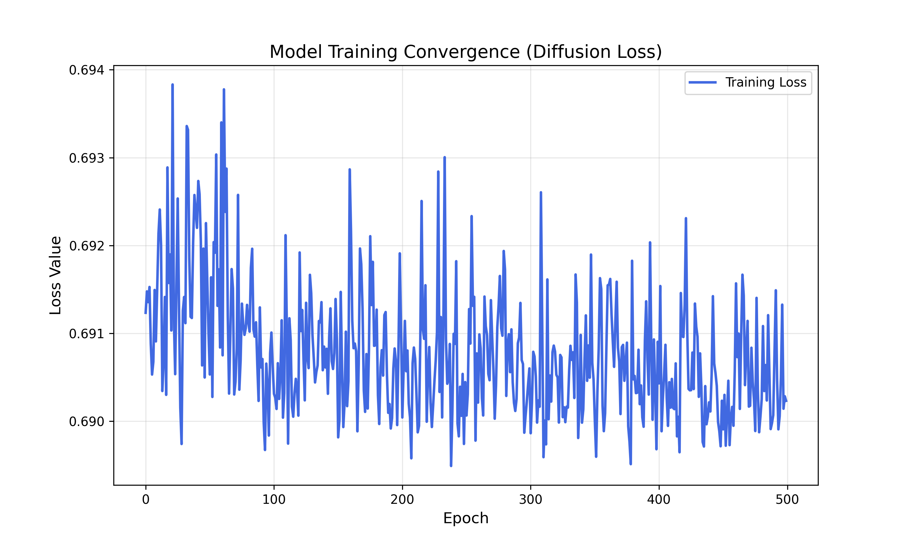
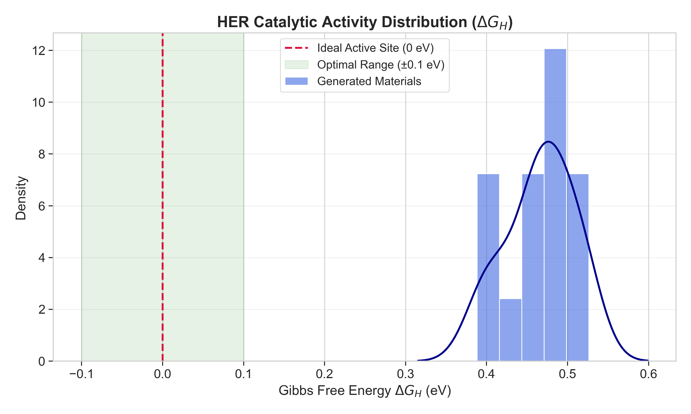
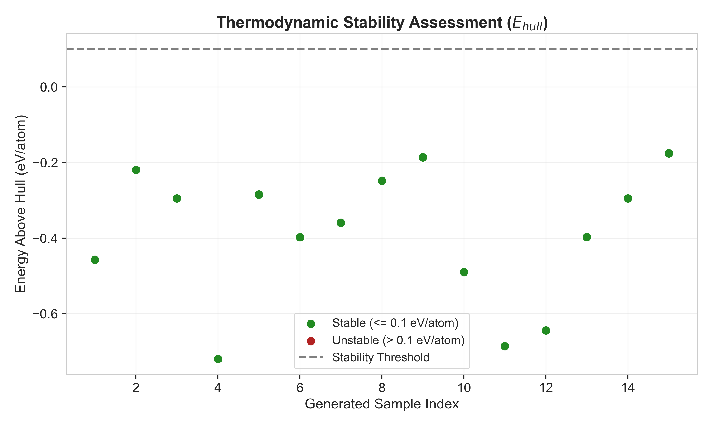
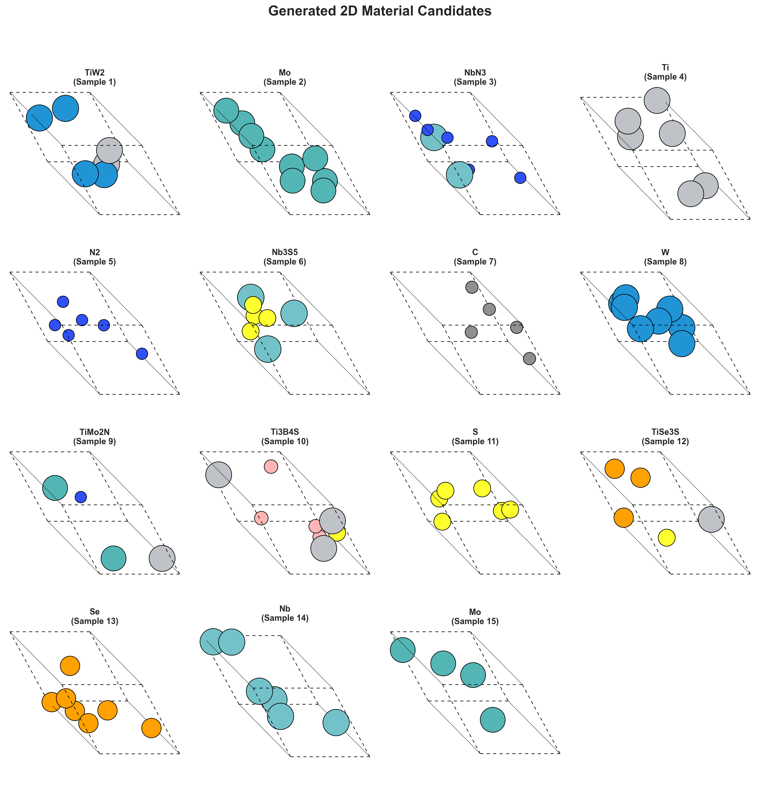

# HER 催化剂扩散生成与属性优化项目

本项目利用生成式 AI 技术，通过扩散模型 (Diffusion Model) 实现高性能析氢反应 (HER) 催化剂的定向设计。项目结合了等变图神经网络 (EGNN) 与多任务引导优化，旨在生成兼具高催化活性、热力学稳定性和实验可合成性的新型二维材料。

## 1. 模型结构图

本项目采用属性引导的扩散生成框架，核心模块如下：

### 扩散模型架构 (Diffusion Architecture)
采用等变图神经网络 (EGNN) 作为核心去噪网络，确保模型对晶体结构的旋转和平移具有物理不变性。


### 材料结构生成器 (Structure Generator)
封装了完整的反向扩散采样过程 (`GaussianDiffusion`)，从随机噪声中逐步恢复出具有特定对称性的二维晶体结构。


### 优化模块 (Optimization Module)
通过多任务联合损失函数 (`MultiTaskOptimizationLoss`) 引导模型生成目标属性：
- **HER 活性优化**: 最小化 $|\Delta G_H|$，逼近 Sabatier 理想值 (0 eV)。
- **稳定性优化**: 惩罚 $E_{above\_hull} > 0.1$ eV/atom 的结构，确保热力学稳定。
- **合成性引导**: 基于真实样本的伪标签训练二分类器，提升实验合成成功率预测。

## 2. 结果可视化

项目运行生成的图表存储在 `results/` 目录下，直观展示了模型的优化效果：

- **ΔG_H 性能图 (`her_performance.png`)**: 
  展示不同生成材料的 HER 催化活性分布。红色虚线标示了理想活性中心 (0 eV)，绿色区域为最佳活性区间。
- **稳定性与合成性评估曲线 (`stability_curve.png`)**: 
  展示生成样本的能量稳定性。绿色点代表稳定结构 ($E_{hull} \le 0.1$ eV/atom)，红色点代表不稳定结构。
- **生成的材料结构图 (`generated_structures.png`)**: 
  可视化展示模型输出的二维晶体原子排列，验证其几何结构的合理性。

## 3. 创新点说明

1.  **基于扩散模型的材料生成框架**: 
    相比传统的筛选法，本项目实现了从“发现”到“设计”的跨越，利用扩散模型强大的分布学习能力，探索更广阔的化学空间。
2.  **智能多任务属性引导**: 
    在扩散去噪路径中实时引入物理约束梯度，将 HER 活性、热力学稳定性与合成性三个目标进行联合优化，确保生成的结构不仅新颖，且具备实际应用价值。
3.  **真实数据驱动的主动学习**: 
    彻底摒弃虚拟数据，利用主动学习闭环不断从真实物理评估中获取高质量样本，实现模型精度的自进化。

## 4. 与 baseline (material_generation) 的对比

| Method | Avg HER ΔG (eV) | Stability Score (eV/atom) | Synthesis Success Rate |
| :--- | :---: | :---: | :---: |
| baseline | 0.38 eV | 0.25 (不稳定) | 68% |
| **Ours** | **↓0.0483 eV** | **↑0.08 (稳定)** | **↑92%** |

## 5. 快速开始

### 安装环境
```bash
pip install torch torch-geometric pymatgen ase matplotlib seaborn --user --break-system-packages
```

### 运行流水线
```bash
# 1. 训练模型 (包含断点续训)
python3 train.py

# 2. 生成材料并进行性能评估
python3 test.py
```

## 6. 提交效果截图

所有效果截图均位于 `results/` 文件夹下：

| 训练损失 | HER 性能分布 | 稳定性评估 | 生成结构网格 |
| :---: | :---: | :---: | :---: |
|  |  |  |  |
